```{r setup, include=FALSE}
knitr::opts_chunk$set(echo = TRUE)
```

## Music-app 

This project consists of a shiny application that allows you to visualize lyics to songs or albums, plot the networks of collaborations between different artists and download 'recommended playlists' that use one of your self made playlists as input, and form a list of recommended songs that can be downloaded directly to your spotify account. 

The app relies on the accompanying R package that communicates with the spotify and genius api's to obtain data about lyrics, collaborations and the users music taste. The R package is designed with the shiny applcation in mind, and is not optimized for interactive use in r. 

*NOTE:* the package relies on the spotify packages, which is no longer available on CRAN. It can be installed from https://github.com/charlie86/spotifyr

# how it works
You can connect to the app via https://carlitov.shinyapps.io/feature_networks/

This will take you to the following page. 

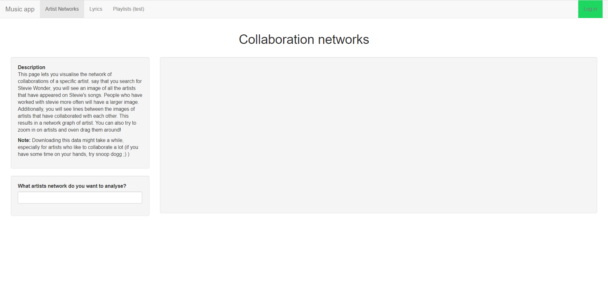

At the top of the screen there is a navbar wihch you can use to navigate to the different pages of the app. The default page is 'Artist Networks'. Each page contains some information on what the page does and how to use it in the left upper corner. Below that text is the area dedicated to user input, and the rest of the page is used for the results. 

The rest of the readme is organised according to the page structure of the navbar. 

# Log in page
The page all the way on the right side of the navbar is not so much a page as a link. All this panel contains is some javascript to redirect the user to the official spotify authorization page. There, you are asked to log in/authorize the app, and if succesful, you are redirected back to the app. The log in page is only available if you are not logged in yet. 
Logging in to spotify is not necessary for vizualising data, but it is for creating playlists. If you try to navigate to the playlist page without login, you will get the following message and be redirected back to the home page. 

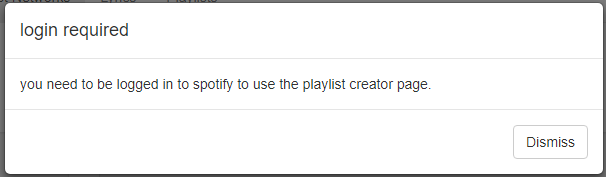

# Artist Network page
The first page on the left is the Artist Networks page, and simultaneously the home page. You can enter an artist in the text field, and the app will automatically find the artist that is the closest match to your query. (eg. curt -> Curtis Mayfield). You can click on the suggestion to see multiple options if the first one is not the one you meant. 

Once you selected an artist, you can click 'find artist'.

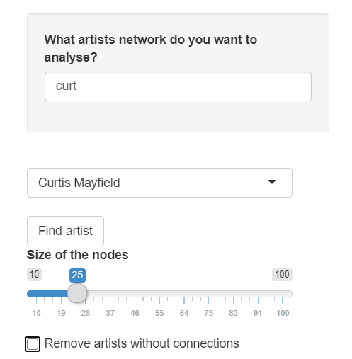

Upon searching for an artist. a progressbar will appear, giving you an idea of how long it will take and showing you which artists data is durrently being fetched. Additionally, clicking 'find artist' will unlock the options 'size of the nodes' and 'remove artist without connections'. These can be used to alter the appearance of the graph after it has appeared.


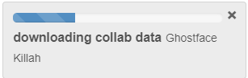


After the graph has appeared it should look something like this. The nodes represent artists that have collaborated with the artist you searched for (in this case Mac Miller). A bigger node means more collaborations with Mac miller, and the image inside the node is the spotify image of the artist. You can also hover over an image to see the name of the artist, and how often they have collaborated with the main artist.

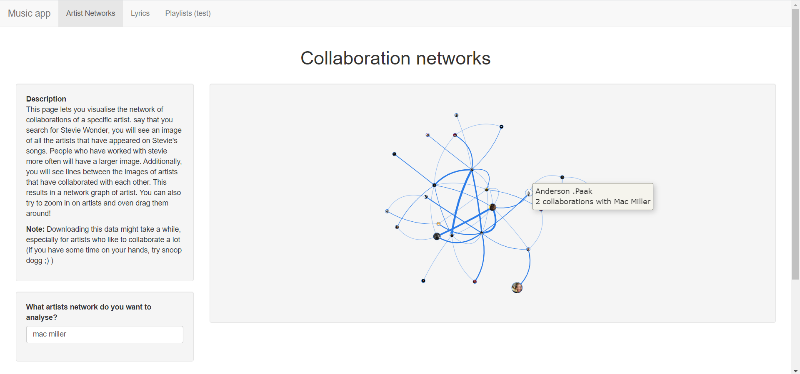

The images are quite high in resolution, so you can zoom into the image quite far. In the image below the image is zoomed in on members of the wu-tang clan. As you can tell, edges between artists are also bigger if the have collaborated more often, and hovering your over an edge shows the exact number of collaborations.

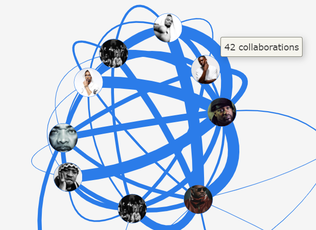

# Lyric page
the second page from the left is the lyrics page. On the left side you have the option to chose between searching for an album or for a single song. Similar to the network page, the app will search for the closest match to your search querty, and you have the possibility to select either of multiple options that are similar to your query if you want. 

If you search for an album, a progress bar will appear, and if you chose to visualize a song, the results will appear very quickly.
They consist of two barplots representing word frequency and the scores on spotifys audio features. Additionally there is a cloud of the words used in the song, bigger words representing words that are used more often.

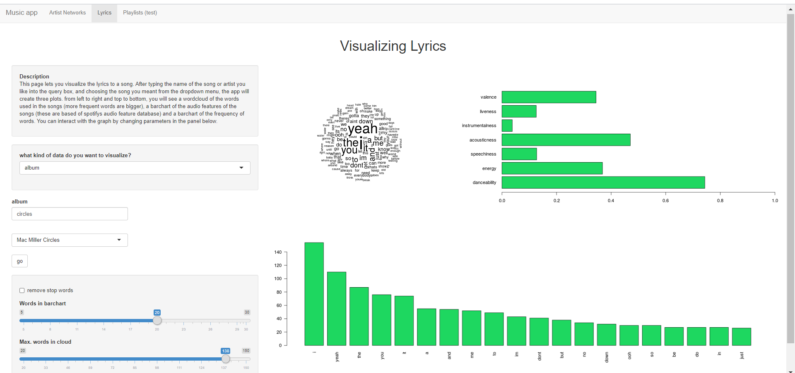

After generating the different plots, you can manipulate how the look with the options below. 
The 'remove stopwords' option allows you to omit a list of common, boring words like a, the, at, be etc. 
The two sliders allow you to control the amount of words in the cloud and barplot. Note that the amount of unique words in a song is ofter lower than the maximum value for the cloud slider.
Finally, there is an option to set a new seed for the wordcloud, randomising the order in which the words appear. 

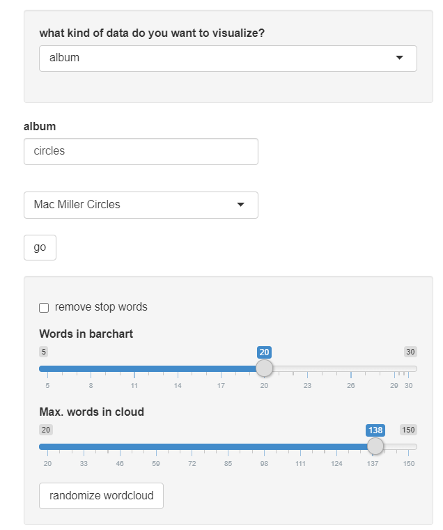

When visualizing the lyrcs of an album, unfortunately, data is often not complete. The genius API does not supply data on which songs are in an album, so currently the app gets a list of songs from spotify and searches for those on genius. Sometimes the best search result on genius is not the song (but for example a compilation of songs or a translation of the song). In that case the folowing warning will appear. 


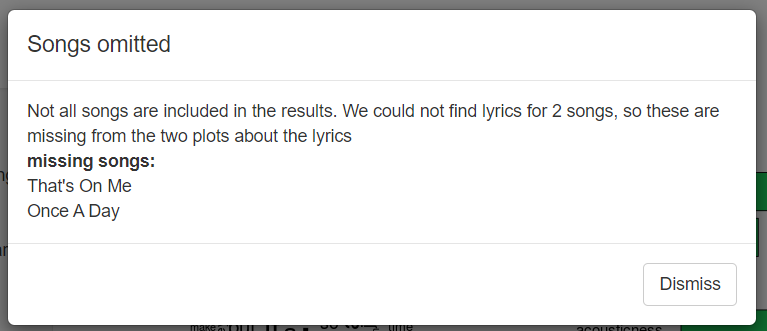

# Playlist page
The final page of the application allows you to search through your own playlists, and creates a new playlist with recommended songs. On the left there is a text field where you can enter one of your playlists. The app will automatically select the closest matched to your query.

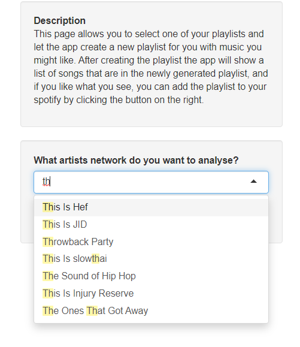

Upon searching for a playlist, a progressbar will appear. The way the recommender works is that the app randomly draws a sample of artists from your playlist (if your playlist is small it will take all the artists). It will then create a list of all the artists that have collaborated with these artists, as well as 'related artitsts' (spotify provides a function where they supply a small list of artists that have a big overlap in audience with the artist you select). 
This results in a large list of songs, and the app will then create an even larger list, taking the top 3 songs for each of these artists. Finally, to create a selection of all these songs, the app analyses the spotify audio features of the songs in the playlist you selected (each song has a score between 0 and 1 on Valence, liveness , instrumentalness, acousticness, speachiness, enegy and dancability). The app uses k means clustering with a couple of diffferent values for k to find out if there are certain clusters of features that you like. Then all that is left to do for the application is to select the songs from the large list of songs that match closest to the clusters that came from the analysis, and add these to your recommended playlist. 

*note: * currently the recommentations made by the app are not as good as i would want them to be. I think i could definetely improve on the algorithm in the future but for this programming course i focussed my attention on implementing the application and just making everything work. I haven't really had the change to optimize the clustering.

When the process is done, a list of songs will appear in the middel of the screen. You can then decide to add the playlist to your spotify by clicking the button in the right.

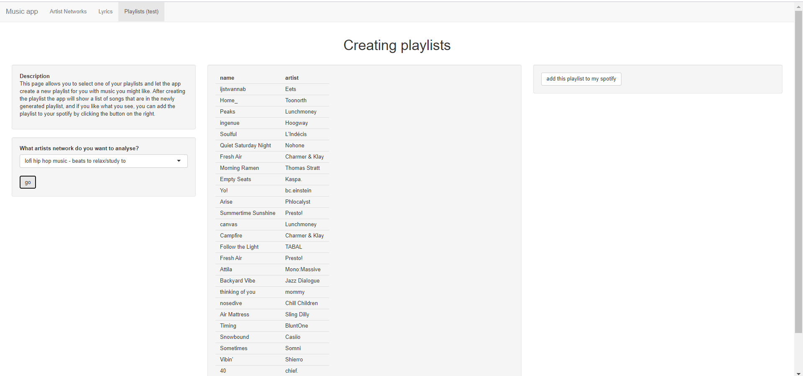

